# 🎬 Netflix Content Strategy Analysis


[](https://github.com/nayana3333/vois-netflix-content-analytics/actions/workflows/verify.yml)


**A hypothesis-driven decision-science analysis of Netflix's 7,789-title catalog — four testable business questions, each answered with a statistical test, a held-out validation, or a baseline comparison. Not a chart that merely "looks like" a trend.**

📊 Data Analysis Internship Project — **Vodafone Idea Foundation (VOIS) × Edunet Foundation**
👤 **Nayana S**

**🚀 [Try the live interactive dashboard](#)** &nbsp;·&nbsp; **📓 [Read the full notebook](notebooks/Netflix_Analysis.ipynb)** &nbsp;·&nbsp; **▶️ [Run it yourself](#how-to-run)**

*(Live dashboard link goes live once deployed — see [Deploying the Dashboard](#deploying-the-dashboard))*

---

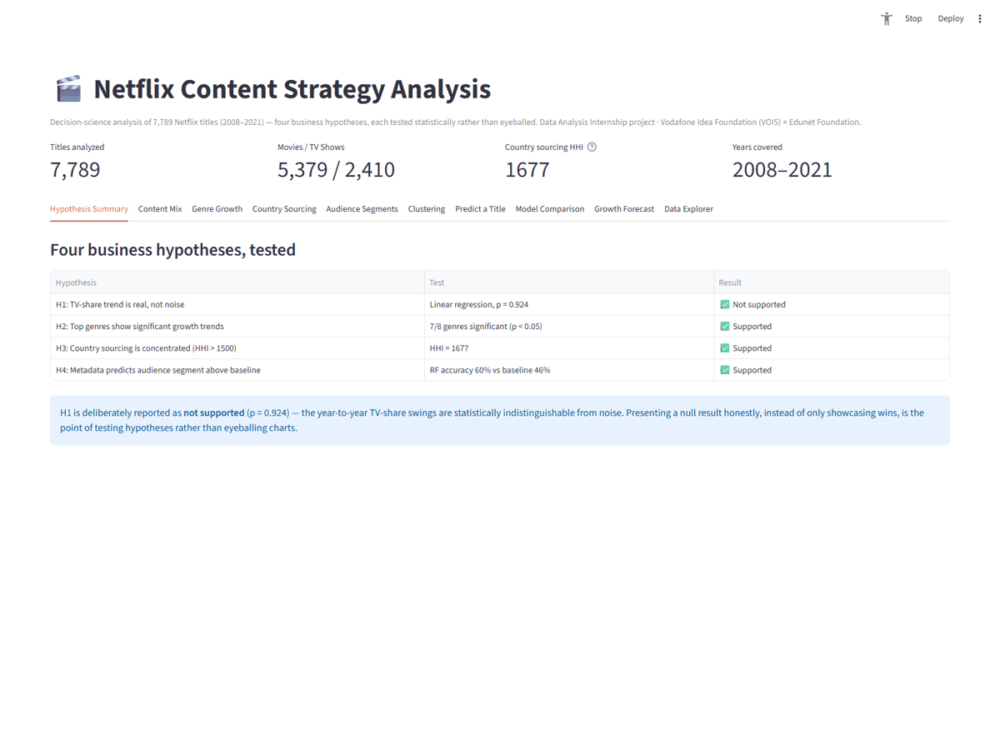

---

## Table of Contents

- [Why This Project Exists](#why-this-project-exists)
- [The Four Hypotheses — Tested, Not Assumed](#the-four-hypotheses--tested-not-assumed)
- [Interactive Dashboard](#interactive-dashboard)
- [Results at a Glance](#results-at-a-glance)
- [Methodology: What Makes This Rigorous](#methodology-what-makes-this-rigorous)
- [Key Findings](#key-findings)
- [Repository Structure](#repository-structure)
- [How to Run](#how-to-run)
- [Continuous Integration](#continuous-integration)
- [Notebook Structure](#notebook-structure)
- [Skills Demonstrated](#skills-demonstrated)
- [Data](#data)
- [Limitations & Next Steps](#limitations--next-steps)
- [Author](#author)

---

## Why This Project Exists

Every catalog dollar Netflix spends acquiring or producing a title is a resource-allocation decision. Most public "Netflix EDA" notebooks stop at pretty charts — this project instead treats the dataset as **evidence for four decisions a content team is implicitly making**, and refuses to call a result "supported" unless a statistical test says so.

| # | Decision Question |
|---|---|
| **D1** | Is Netflix shifting investment toward TV Shows or Movies — and is that shift statistically real? |
| **D2** | Which genres are structurally growing vs. shrinking, with significance, not eyeballing? |
| **D3** | How concentrated is content sourcing by country — is that a strategic risk? |
| **D4** | Can a title's target audience be predicted from metadata alone, at scale? |

## The Four Hypotheses — Tested, Not Assumed

| Hypothesis | Test | Result |
|---|---|---|
| **H1** — TV-share trend is real, not noise | Linear regression, TV-Show share of yearly additions vs. year | ❌ **Not supported** — p = 0.924 |
| **H2** — Top genres show significant growth trends | Per-genre linear regression, 2015–2020 | ✅ **Supported** — 7 of 8 top genres significant (p < 0.05) |
| **H3** — Country sourcing is concentrated | Herfindahl-Hirschman Index (HHI) on primary country | ✅ **Supported** — HHI = 1,677 (US alone = 37% of catalog) |
| **H4** — Metadata predicts audience segment above baseline | Random Forest vs. majority-class baseline, held-out test set **+ 5-fold cross-validation** | ✅ **Supported** — 60% accuracy vs. 46% baseline; 58.8% ± 1.1% under CV vs. 55.2% ± 0.6% for a Logistic Regression baseline |

> **H1 is deliberately reported as failing.** A project optimized to "look impressive" would suppress or spin a null result. This one reports it plainly — the year-to-year TV-share swings are statistically indistinguishable from noise — because that's what the data actually says.

## Interactive Dashboard

Beyond the notebook, the full analysis is wrapped in a **10-tab Streamlit + Plotly dashboard** — live filters, an interactive K-Means explorer, a Random Forest classifier you can query in real time with a **per-prediction SHAP explanation**, and a searchable/downloadable data explorer.

<table>
<tr>
<td width="50%">

**Hypothesis Summary**
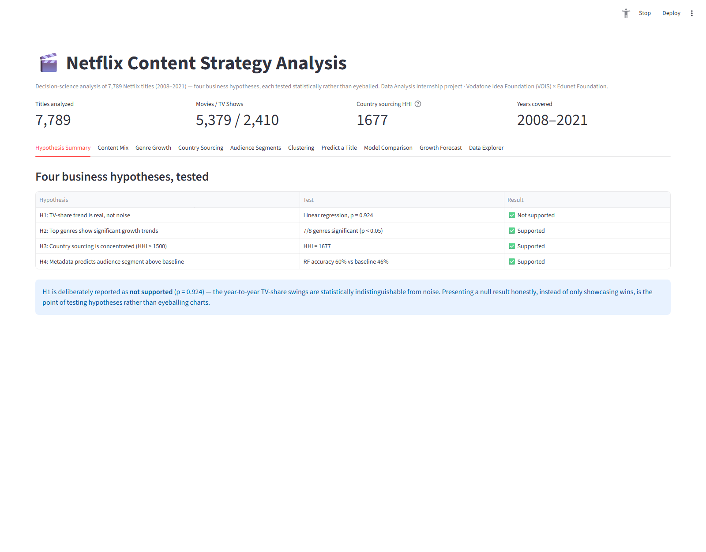

</td>
<td width="50%">

**Content Mix Trend**
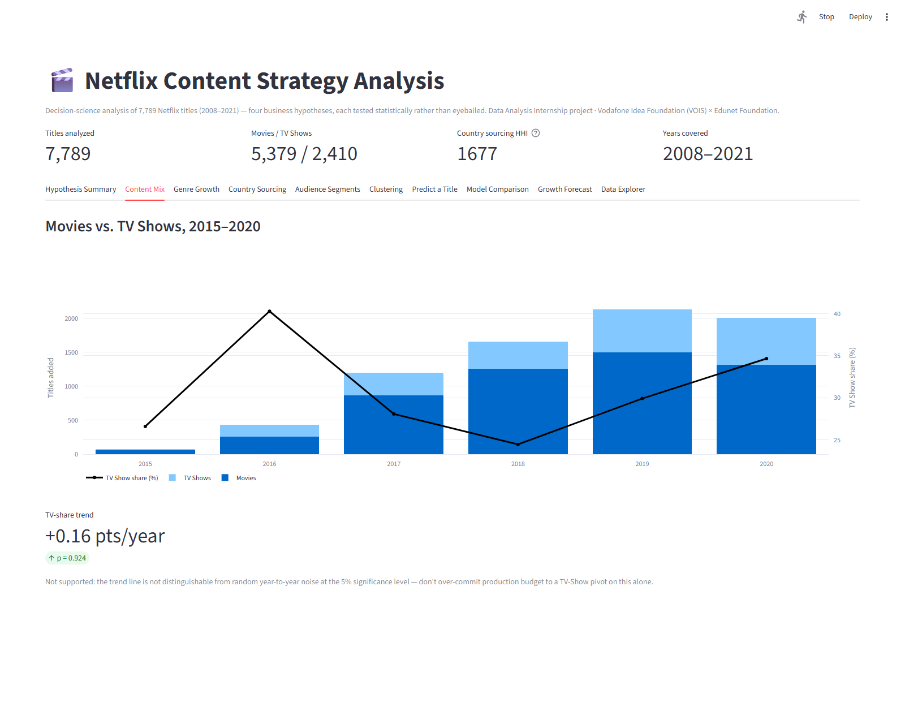

</td>
</tr>
<tr>
<td width="50%">

**Genre Growth (filterable)**
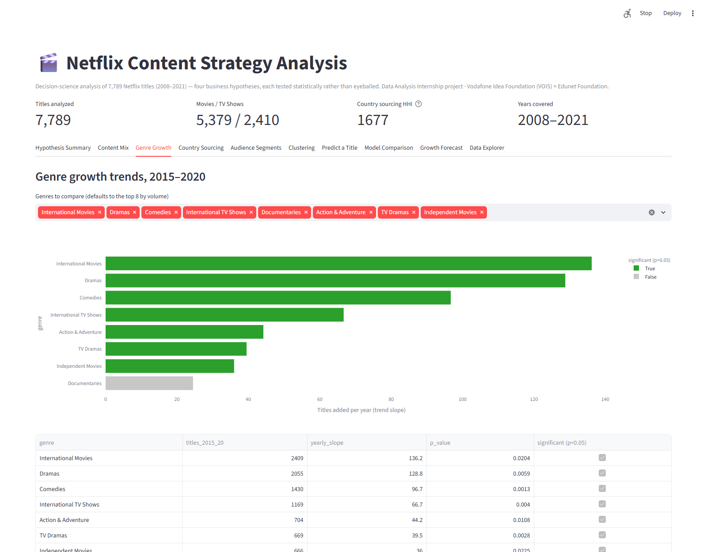

</td>
<td width="50%">

**Country Sourcing**
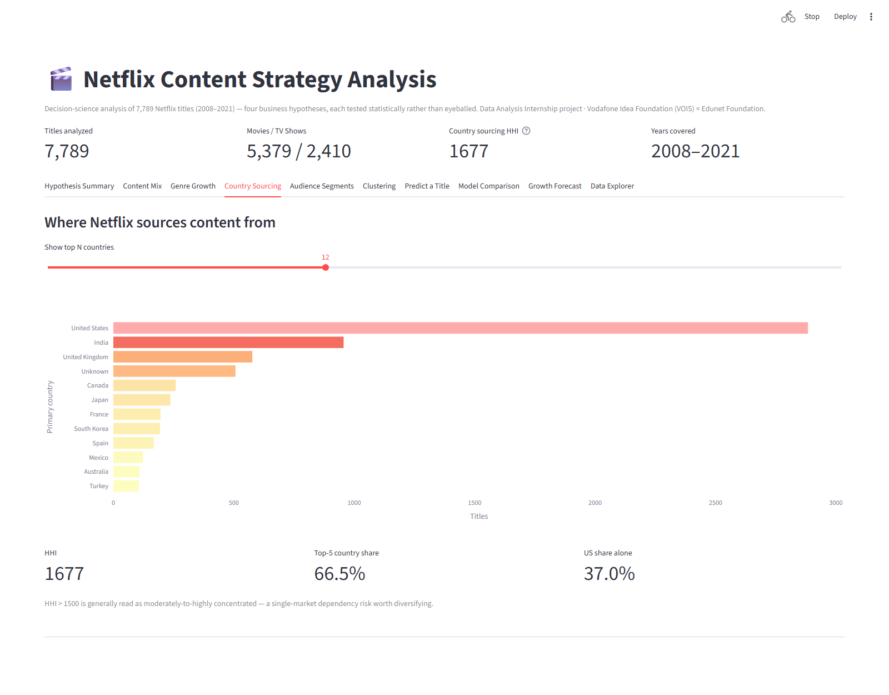

</td>
</tr>
<tr>
<td width="50%">

**K-Means Cluster Explorer**
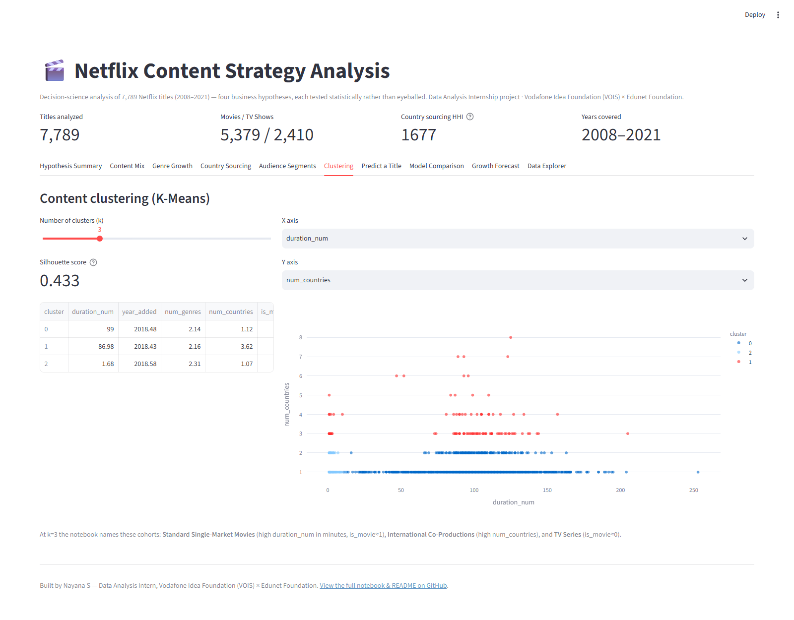

</td>
<td width="50%">

**Live Prediction + SHAP Explanation**
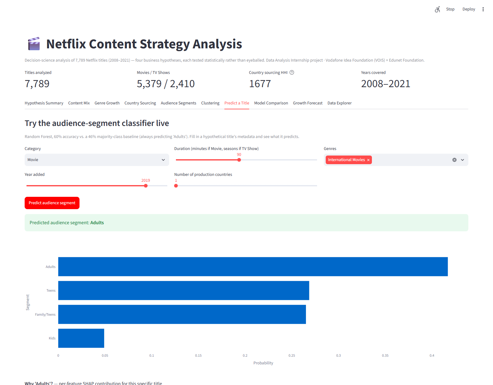

</td>
</tr>
<tr>
<td width="50%">

**Model Comparison (Cross-Validated)**
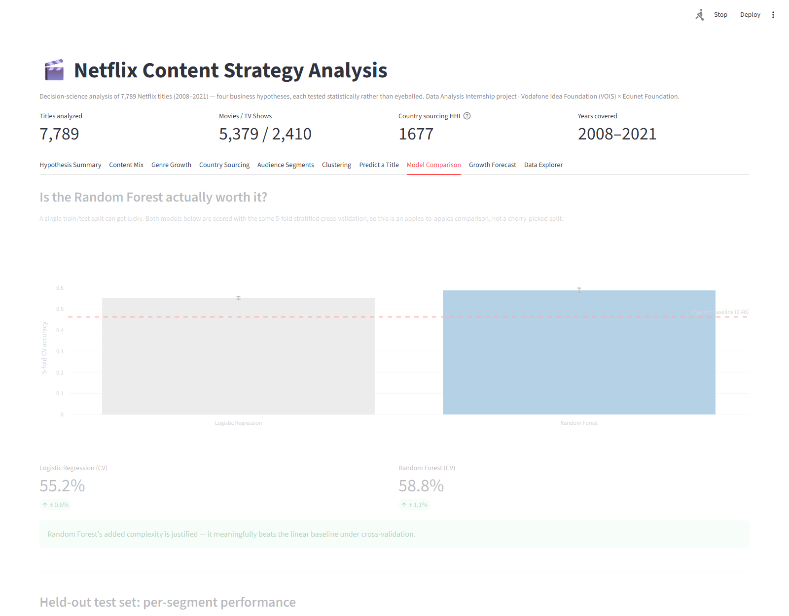

</td>
<td width="50%">

**Searchable Data Explorer**
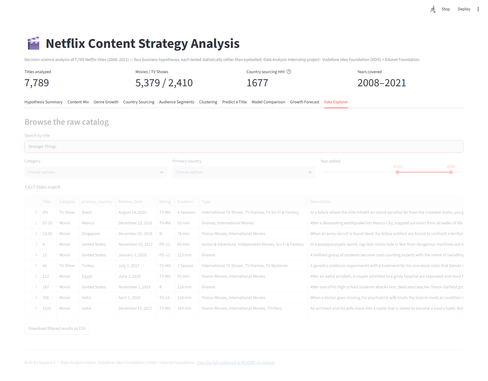

</td>
</tr>
</table>

### What makes the dashboard more than a UI wrapper

- **"Predict a Title"** doesn't just return a label — it runs a live SHAP explanation showing *which specific features* pushed *that specific input* toward its predicted segment, red for "toward," blue for "away from."
- **"Model Comparison"** cross-validates Random Forest against Logistic Regression live, so the model choice is justified by evidence in the same interface a reviewer is looking at.
- **"Data Explorer"** lets anyone search/filter the raw 7,789-title catalog and export the filtered slice as CSV — no need to trust a static chart.
- Every number in the dashboard is computed from `data/Netflix_Dataset.csv` at runtime — nothing is hardcoded.

## Results at a Glance

Charts exported directly from the notebook's actual execution:

| Content Mix Trend | Genre Growth Significance |
|---|---|
| 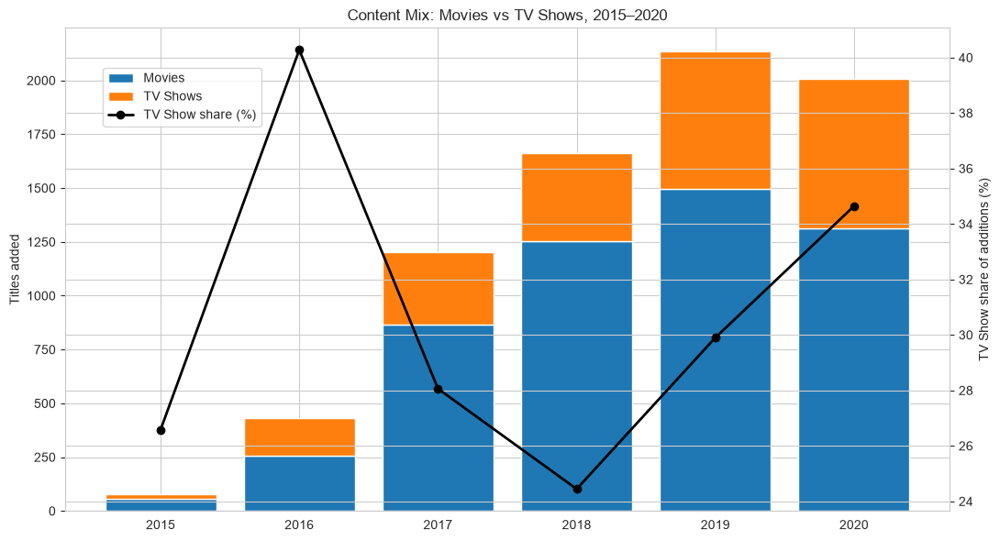 | 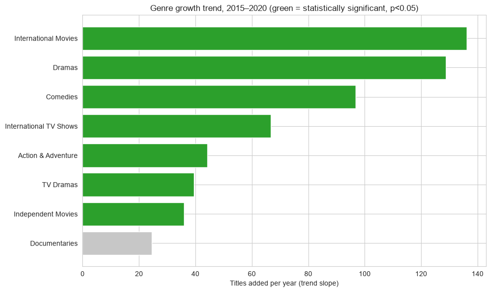 |

| Country Sourcing Concentration | Audience Segment Mix |
|---|---|
| 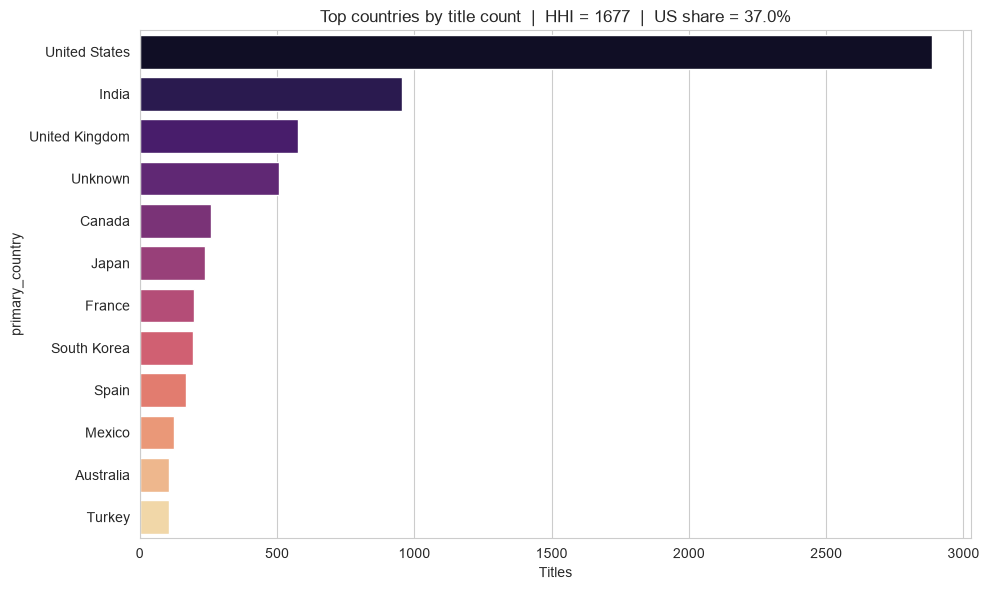 | 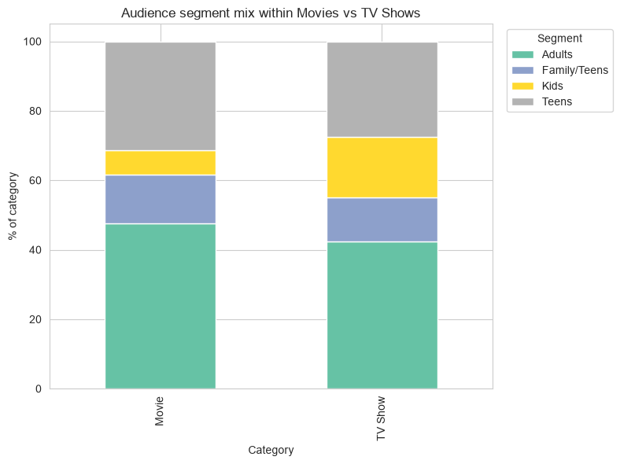 |

| K-Means Cluster Selection (Silhouette) | Random Forest Feature Importance |
|---|---|
| 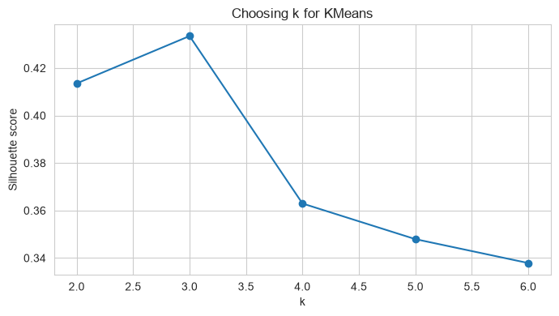 | 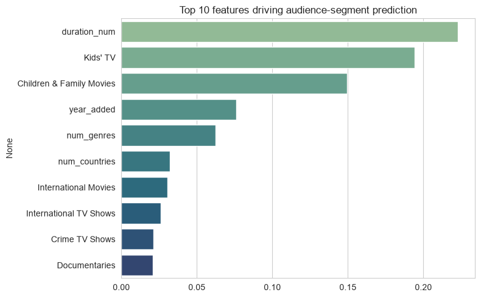 |

| Catalog Growth Forecast (Holdout-Validated) | Model Comparison (5-fold CV) |
|---|---|
| 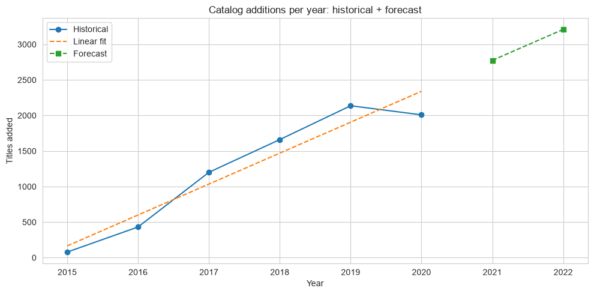 | 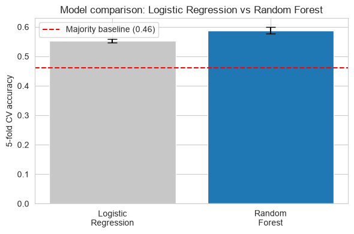 |

| SHAP Explainability (per-feature impact across the model) |
|---|
| 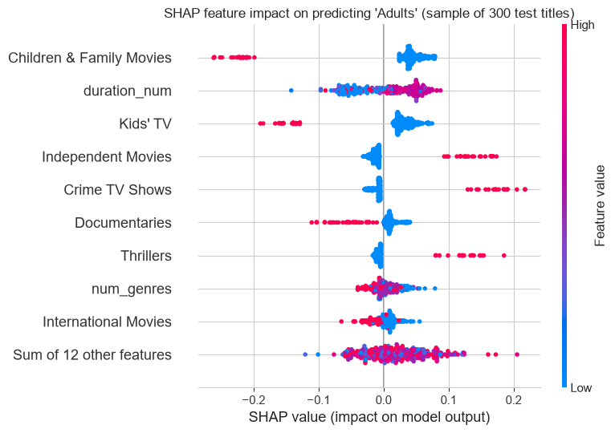 |

## Methodology: What Makes This Rigorous

- **Duration is split by type before comparison** — the raw `Duration` field mixes minutes (movies) and seasons (TV shows) in one text column; treating them as one numeric scale would make cross-category comparisons meaningless.
- **Trend claims are tested, not eyeballed.** Every "genre X is growing" or "TV shows are rising" statement is backed by a regression p-value, not a chart that looks like it's going up.
- **Clustering uses a justified k.** K-Means is run for k=2..6 and the silhouette score picks k=3 (score 0.433), rather than assuming 3 clusters upfront. The resulting cohorts are named in business terms: *TV Series*, *International Co-Productions*, *Standard Single-Market Movies*.
- **The forecast is validated on a genuine holdout**, not training-set fit. The last 2 years (2019–2020) are held out and never seen during fitting; the reported 21% MAPE is the honest, unseen-data error — a linear trend over-forecasts 2020, plausibly reflecting COVID-era production slowdowns.
- **The classifier's accuracy is reported against a baseline**, not in isolation — 60% only means something next to the 46% you'd get by always guessing the majority class ("Adults").
- **A single train/test split isn't trusted on its own.** The classifier is re-validated with 5-fold stratified cross-validation (58.8% ± 1.1%) and compared against a Logistic Regression baseline (55.2% ± 0.6%) — the Random Forest's added complexity is only kept because it measurably earns it.
- **Feature importance isn't taken as explanation.** `feature_importances_` says which features matter on average across the forest; SHAP values decompose *individual* predictions into per-feature contributions, which is also what powers the live per-title explanation in the dashboard.
- **Reproducibility is enforced, not claimed.** A CI workflow re-installs dependencies and re-executes the entire notebook on every push — see [Continuous Integration](#continuous-integration).

## Key Findings

1. **Content mix**: TV-Show share moved from ~27% (2015) to ~35% (2020), but the year-to-year trend is statistically indistinguishable from noise (p = 0.924) — don't over-commit production budget to a TV-Show pivot on this evidence alone.
2. **Genre growth**: International Movies, Dramas, and Comedies show statistically significant upward trends — the defensible genres for continued investment.
3. **Sourcing risk**: HHI of 1,677 (moderately concentrated) with 37% US dependency and 66.5% from the top 5 countries — a real diversification consideration.
4. **Audience-segment tagging**: A Random Forest classifier can auto-tag new titles by target audience at 60% accuracy (vs. 46% baseline; 58.8% under cross-validation, beating a 55.2% Logistic Regression baseline), viable as first-pass triage with human review on the weaker "Family/Teens" segment. SHAP analysis shows genre tags ("Children & Family Movies", "Kids' TV", "Crime TV Shows") drive individual predictions more than duration or year.
5. **Forecasting discipline**: Present catalog-growth forecasts as a range (±21% MAPE), not a single confident number.

## Repository Structure

```
vois-netflix-content-analytics/
├── data/
│   └── Netflix_Dataset.csv        # 7,789 titles, source data
├── notebooks/
│   └── Netflix_Analysis.ipynb     # Full analysis, executed end-to-end, 0 errors
├── images/                        # Charts exported from the notebook
├── screenshots/                   # Real dashboard screenshots + demo.gif
├── app.py                         # Interactive Streamlit + Plotly dashboard
├── requirements.txt                # Pinned versions, installs clean on a fresh machine
├── .github/workflows/verify.yml   # CI: re-executes the notebook on every push
└── README.md
```

## How to Run

```bash
git clone https://github.com/nayana3333/vois-netflix-content-analytics.git
cd vois-netflix-content-analytics
python -m venv .venv
.venv\Scripts\activate      # Windows  (use: source .venv/bin/activate on macOS/Linux)
pip install -r requirements.txt
jupyter notebook notebooks/Netflix_Analysis.ipynb
```

The notebook reads `../data/Netflix_Dataset.csv` and reproduces every number and chart in this README from scratch — no hidden state, no hardcoded results. This has been verified with a genuine from-scratch clone + fresh virtual environment, not just "it worked on my machine."

### Running the Dashboard Locally

```bash
streamlit run app.py
```

Opens at `http://localhost:8501`. The dashboard shares the exact same feature engineering and hypothesis tests as the notebook, plus:
- Live filters on genres and countries
- An interactive K-Means explorer (pick k, pick axes, watch clusters and silhouette score update)
- A **"Predict a Title"** tab — enter hypothetical metadata and get a live prediction, probability breakdown, and a **per-prediction SHAP explanation**
- A **"Model Comparison"** tab — Random Forest vs. Logistic Regression under 5-fold cross-validation, plus the full per-segment classification report
- A **"Data Explorer"** tab — search/filter the raw catalog by title, category, country, and year, with CSV export
- An adjustable-horizon growth forecast

### Deploying the Dashboard

Free to deploy on [Streamlit Community Cloud](https://streamlit.io/cloud):
1. Sign in at share.streamlit.io with GitHub.
2. **"New app"** → this repo → branch `main` → main file path `app.py`.
3. Deploy — it auto-installs from `requirements.txt`.

## Continuous Integration

[`.github/workflows/verify.yml`](.github/workflows/verify.yml) re-installs every dependency from a clean slate and re-executes the entire notebook, end to end, on **every push to `main`** — and fails the build on any cell error. The "Verify" badge at the top of this README reflects the live status of that workflow, not a one-time claim made when the repo was first uploaded.

## Notebook Structure

| Section | Content |
|---|---|
| 1–2 | Business context & hypotheses |
| 3–5 | Setup, data load, cleaning & feature engineering |
| 6 | H1 — content mix trend test |
| 7 | H2 — genre growth trend test |
| 8 | H3 — country concentration (HHI) |
| 9 | Audience segment × category association (chi-square) |
| 10 | Content clustering (K-Means, silhouette-selected k) |
| 11 | H4 — audience-segment classifier (Random Forest) |
| 11.1 | Model rigor — 5-fold cross-validation vs. Logistic Regression baseline |
| 11.2 | Explainability — SHAP per-prediction feature contributions |
| 12 | Growth forecast with holdout validation (MAPE) |
| 13 | Hypothesis test summary table |
| 14 | Quantified strategic recommendations |
| 15 | Executive summary |

## Skills Demonstrated

- **Statistical inference**: linear regression trend testing, chi-square test of independence, significance thresholds — not chart-reading
- **Unsupervised learning**: K-Means clustering with silhouette-based model selection
- **Supervised learning**: Random Forest classification, evaluated against an explicit baseline, validated with 5-fold stratified cross-validation, benchmarked against Logistic Regression
- **Model explainability**: SHAP (SHapley Additive exPlanations) for per-prediction, per-feature attribution — beyond aggregate feature importance
- **Time-series validation**: forecast honesty via genuine held-out years and MAPE, not training-fit error
- **Feature engineering**: parsing mixed-unit fields, multi-label genre/country handling, business-rule-based audience segmentation
- **Business translation**: every statistical result mapped to a specific, quantified recommendation
- **Application development**: a deployable interactive dashboard (Streamlit + Plotly) exposing live filtering and real-time model inference — not just a static notebook
- **Engineering discipline**: pinned dependencies, CI-enforced reproducibility, a repo a stranger can clone and run without help

## Data

`Netflix_Dataset.csv` — 7,789 titles with fields: `Show_Id, Category, Title, Director, Cast, Country, Release_Date, Rating, Duration, Type (genres), Description`.

## Limitations & Next Steps

This analysis is built on catalog metadata only — it describes *what Netflix has*, not *what subscribers actually watch*. The natural next step is joining this with viewership/engagement data (e.g., hours watched, completion rate) to move from a content-description exercise to a true content-ROI analysis.

## Author

**Nayana S**
Data Analysis Intern — Vodafone Idea Foundation (VOIS) × Edunet Foundation, Sep–Oct 2025

[GitHub](https://github.com/nayana3333) · [Notebook](notebooks/Netflix_Analysis.ipynb) · [Live Dashboard](#)
